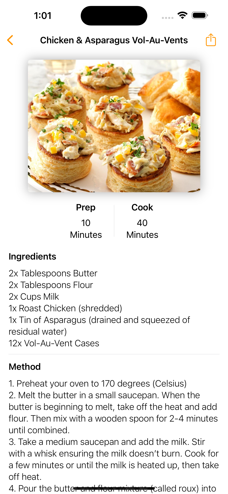

# Sous

## Description

The Sous app is a recipe manager that allows users to create, edit, and delete recipes. Users can also share recipes with others, search for recipes, and filter recipes by category. Through using SwiftUI and Core Data, the app provides a seamless user experience for managing recipes between sessions. 

## Technologies

- Swift
- SwiftUI
- Core Data

## Features

- Create, edit, and delete recipes
- Onboarding experience
- Share recipes with others
- Search for recipes
- Filter recipes by category

## Screenshots

## Usage

To run this application, you need to have Xcode installed on your machine. 

1. Clone this repository
2. Open the project in Xcode
3. Run the application on a simulator or physical device